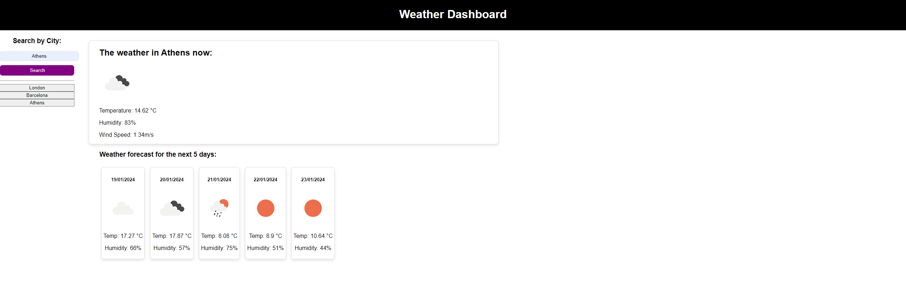

# Weather Forecast_AP

This application is a simple weather app based on the openweathermap API.

​[Deployed Application](https://lxpap.github.io/Weather_AP)

## Installation

No installation is necessary for this application.

## Usage

This application enables the user to search for a city and see the current weather as well as a weather forecast for the next 5 days. Past searches are stored and easily accessible through the left hand side of the app, and data gets refreshed with every search.

   

   

## Credits

Information and research to aid development was done using the following resources:

[StackOverflow](https://stackoverflow.com/)

[MDN](https://developer.mozilla.org/en-US/)

[ClaudeAI](https://claude.ai/)

## License

A copy of the MIT License can be found in this repository.
